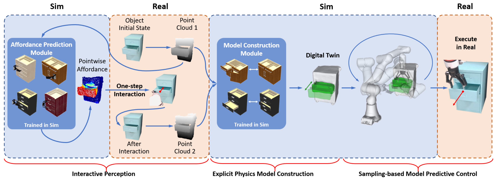

# Sim2Real2
Code for the ICRA 2023 paper "Sim2Real$^2$: Actively Building Explicit Physics Model for Precise Articulated Object Manipulation"


[Website](https://ttimelord.github.io/Sim2Real2)|[arXiv]()|[Video](https://youtu.be/Xj2N2Hy38P4)

## About This Repo
The Sim2Real$^2$ algorithm has 3 parts, the **Interactive Perception** module, the **Explicit Physics Model Construction** module and the **Sampling-based Model Predictive Control** module. They are corresponding to 3 folders in this repo, `where2act`, `ditto`, and `CEM`. [Sapien](https://github.com/haosulab/SAPIEN) was used for all the training and planning processes.

For the Interactive Perception module, We migrated [Where2Act](https://github.com/daerduoCarey/where2act) to Sapien2 and Modified the point cloud normalization method.

For the Explicit Physics Model Construction modul, we reimplemented the data generation code of [Ditto](https://github.com/UT-Austin-RPL/Ditto) with Sapien2 and Open3d. The data can be collected in a multi-processes manner like where2act.

For the Sampling-based Model Predictive Control module, we choose [ManiSkill2](https://github.com/haosulab/ManiSkill2) and [ManiSkill2-Learn](https://github.com/haosulab/ManiSkill2-Learn) as the basic framework.

## Installation
Create a conda environment. Install `pytorch` and `cuda` according to your system.

Install required packages: install the required package for each of the 3 parts, or use the integrated `requirements.txt` in the root directory.

Install additional packages below.
### Where2act
Install Pointnet2_Pytorch as described in Where2act:
>Then, if you want to run the 3D experiment, this depends on PointNet++.
>```
>git clone --recursive https://github.com/erikwijmans/Pointnet2_PyTorch
>cd Pointnet2_PyTorch
># [IMPORTANT] comment these two lines of code:
>#   https://github.com/erikwijmans/Pointnet2_PyTorch/blob/master/pointnet2_ops_lib/pointnet2_ops/_ext-src/src/sampling_gpu.cu#L100-L101
>pip install -r requirements.txt
>pip install -e .
>```

### Ditto
>Build ConvONets dependents by running `python scripts/convonet_setup.py build_ext --inplace`.

### CEM
Install ManiSkill2 and ManiSkill2-Learn:
```
cd {parent_directory_of_Sim2Real2}
cd Sim2Real2/CEM
pip install -e .
cd ManiSkill2-Learn/
pip install -e .
```

### Some Conflictions
It should be noted that there are package version conflicts between Where2Act and Ditto.
When training the where2act network, you should use (demanded by Pointnet2_Pytorch):
```
pytorch-lightning==0.7.1
hydra-core==0.11.3
```
When training the Ditto network, you should use:
```
pytorch-lightning==1.5.4
hydra-core==1.1.0.rc1
```
### Convex Decomposition
If you want to import the URDF built by Ditto into the simulator, we recommend you to use [VHACD](https://github.com/Unity-Technologies/VHACD) to first decompose the meshes into convex parts. This process can be added to `generate_digital_twin.py` for convenience.

## Training and Planning in Simulation
### Where2Act
Scripts for data collection, training and evaluation are stored in `where2act/code/scripts`. Run `bash xxxx.sh` in a terminal.

### Ditto
Scripts for data collection are stored in `ditto/scripts`.

Training: `python run.py experiment=all_stereo.yaml`

Generate digital twin: `python generate_digital_twin.py`

### CEM
Before starting planning, modify the paths of the config and the urdf file. You can modify parameters of CEM in `CEM/ManiSkill2-Learn/configs/mpc/cem/maniskill2_DigitalTwin.py`

You can modify the controller's config in `CEM/ManiSkill2/mani_skill2/assets/config_files/agents/fixed_xmate3_robotiq.yml`.

You can modify the reward function in `CEM/ManiSkill2/mani_skill2/envs/CEM_env.py`.

Start planning by:

```
cd {parent_directory_of_Sim2Real2}
cd Sim2Real2/CEM/ManiSkill2-Learn
python maniskill2_learn/apis/run_rl.py configs/mpc/cem/maniskill2_DigitalTwin.py --gpu-ids 0 --dev
```

Videos and trajectories are stored in `CEM/ManiSkill2-Learn/work_dirs`

## Real Experiments
In order to do the real experiment, a module that can acquire measurements from the depth camera and control the robot to replay the trajectory from where2act or CEM should be created additionally.

## Citations
```

```